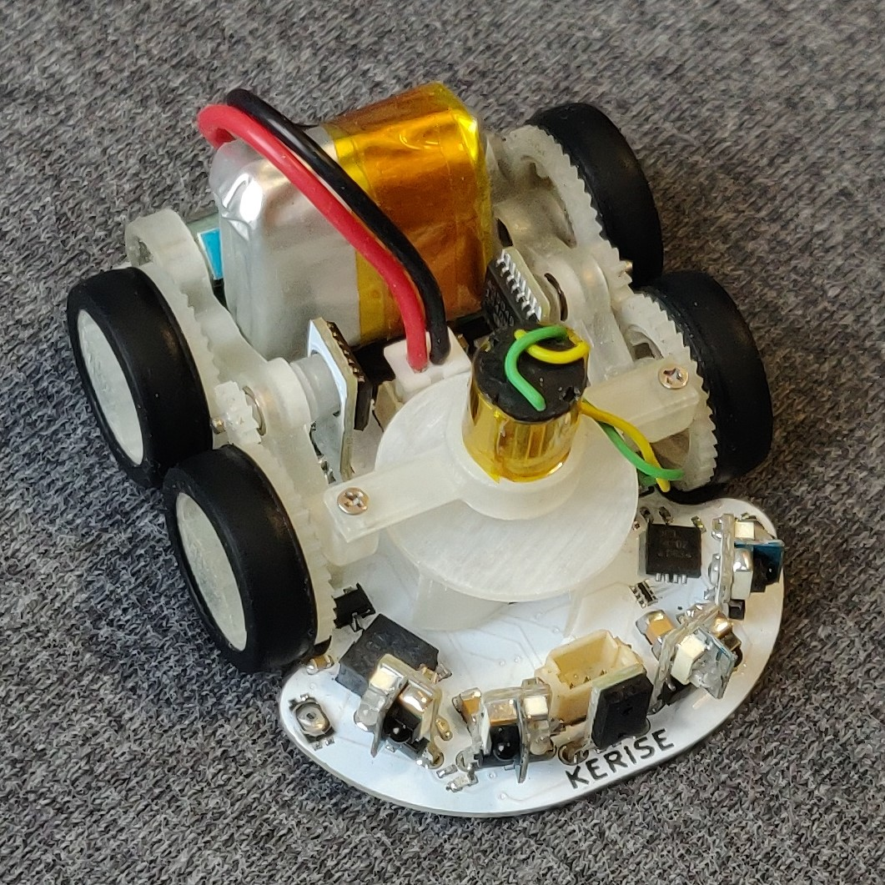

# MicroMouse KERISE v4

ハーフサイズマイクロマウス

## 戦績

- 第40回全日本マイクロマウス大会2019
  - マイクロマウス競技ファイナル 第11位
  - マイクロマウス競技ファイナル 特別賞
- 第41回全日本マイクロマウス大会2020
  - マイクロマウス競技 完走
- 第42回全日本マイクロマウス大会2021
  - マイクロマウス競技ファイナル リタイヤ

## スペック

| 部品               | 型番          | 備考                              |
| :----------------- | :------------ | :-------------------------------- |
| モーター           | 不明          | 直径6mm 長さ10mm コアレスモーター |
| エンコーダ         | AS5048A       | 4096パルス 磁気式                 |
| マイコン           | ESP32-PICO-D4 | 240MHz dual core                  |
| 赤外線LED          | SFH4045N      | 波長940mm                         |
| フォトトランジスタ | SFH3015FA     | 波長940nm                         |
| モータードライバ   | DRV8835       | 最大電流1.5A x 2ch                |
| 6軸センサ          | ICM-20602 x2  | 3軸ジャイロ+3軸加速度             |
| バッテリー         | 不明          | 3.7V 25C 100mAh 1S                |

## 回路設計

- KiCad

## 機体設計

- Fusion 360

## 開発環境

- PlatformIO Espressif32 ESP-IDF
